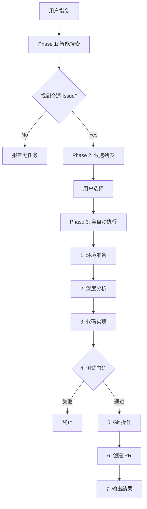

# GitHub PR 自动化技能

[English](./README.md) | [中文](./README_zh.md)

<p align="center">
  
  
  
</p>

<p align="center">
  🤖 全自动化的 GitHub 开源贡献助手 —— 从智能搜索 Issue 到自动提交 PR，全程无需干预
</p>

---

## 📋 简介

GitHub PR Automation Skill 是一个 OpenClaw/Claude Code 智能体技能，专门用于自动化开源项目贡献流程。

### ✨ 核心功能

- 🔍 **智能 Issue 搜索** - 多维度过滤（时间、语言、难度、标签）
- 🎯 **极简交互** - 用户只需回复数字选择任务
- ⚡ **全自动执行** - Clone → 分析 → 编码 → 测试 → PR，一气呵成
- 🛡️ **测试门禁** - 强制本地测试通过后才提交，绝不推送未验证代码

---

## 🚀 快速开始

### 触发词

```
开源贡献, GitHub贡献, find issue, good first issue, 提交PR, 贡献项目, auto PR, 自动贡献
```

### 前置要求

1. **GitHub CLI** (`gh`) - 用于 Git 操作
   ```bash
   # macOS
   brew install gh
   
   # Linux
   sudo apt install gh
   
   # Windows
   winget install GitHub.cli
   ```

2. **GitHub Token** - 创建 Personal Access Token
   - 访问: https://github.com/settings/tokens
   - 权限要求:
     - `repo` (完整仓库访问)
     - `workflow` (如需修改 Actions)
   - 建议使用 Fine-grained PAT

3. **环境变量配置**

   创建 `.env` 文件或设置环境变量:
   ```bash
   export GH_TOKEN="ghp_xxxxxxxxxxxxxxxxxxxx"
   export PREFERRED_LANGUAGE="python"  # 可选: python, javascript, typescript, go, rust
   export ENABLE_LOCAL_TEST=true        # 强烈建议保持 true
   export AUTO_PUSH=false                # 新手建议保持 false
   ```

---

## 📖 使用流程

### Step 1: 发起任务

```
User: 帮我找个 good first issue 做做
```

### Step 2: 选择任务

AI 返回候选列表，用户回复数字:

```
🔍 已找到 3 个适合您的 Python 开源任务：

1. 🐛 [Fix] 修复用户登录时空指针异常
   📁 项目: awesome-project
   🎯 难度: ⭐⭐
   
2. ✨ [Feature] 添加 --version 参数
   📁 项目: cli-tool
   🎯 难度: ⭐
   
3. 📚 [Docs] 更新安装文档
   📁 项目: doc-site
   🎯 难度: ⭐

👉 请回复数字 (1/2/3) 选择任务
```

### Step 3: 全自动执行

用户选择后，AI 自动完成:

```
🚀 开始执行...

[1/7] 环境准备 ✓
[2/7] 深度分析 ✓  
[3/7] 代码实现 ✓
[4/7] 本地测试 ✓ ← 测试门禁
[5/7] Git 提交 ✓
[6/7] 创建 PR ✓
[7/7] 完成! ✓

✅ PR 已创建: https://github.com/owner/repo/pull/42
```

---

## ⚙️ 配置选项

| 环境变量 | 默认值 | 说明 |
|---------|--------|------|
| `GH_TOKEN` | (必填) | GitHub Personal Access Token |
| `PREFERRED_LANGUAGE` | `python` | 首选编程语言 |
| `MAX_ISSUE_AGE_DAYS` | `30` | 最大 Issue 年龄 |
| `CANDIDATES_PER_BATCH` | `3` | 每次展示候选数量 |
| `ENABLE_LOCAL_TEST` | `true` | 强制本地测试 |
| `AUTO_PUSH` | `false` | 测试通过后自动推送 |
| `TEST_TIMEOUT` | `300` | 测试超时时间(秒) |

---

## 🏗️ 架构



---

## 📦 支持的项目类型

| 语言 | 检测文件 | 测试命令 |
|------|---------|---------|
| Python | `pytest.ini`, `setup.py`, `pyproject.toml` | `pytest` |
| Node.js | `package.json` | `npm test` |
| Go | `go.mod` | `go test ./...` |
| Rust | `Cargo.toml` | `cargo test` |
| Make | `Makefile` | `make test` |

---

## ⚠️ 注意事项

1. **测试门禁不可关闭** - 强烈建议保持 `ENABLE_LOCAL_TEST=true`
2. **尊重许可证** - 只贡献符合开源许可证的项目
3. **遵循贡献指南** - 阅读并遵守 `CONTRIBUTING.md`
4. **声明辅助开发** - 在 PR 中标注 "Assisted development"
5. **质量优先** - 宁可不做，也不提交低质量代码

---

## 📝 License

MIT License - See [LICENSE](./LICENSE) for details.

---

## 🤝 贡献

欢迎提交 Issue 和 Pull Request！

---

*🤖 This skill is maintained by OpenClaw Community*
